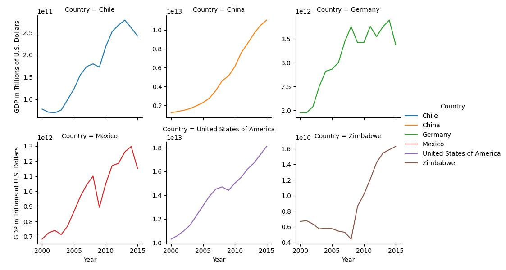

# Daniel_Portafolio
 Bienvenido a mi Portafolio, donde muestro algunos proyectos relacionados a herramientas y habilidades entorno a Ciencia de Datos, entre los  proyectos, abordo temas de visualización de datos, limpieza de datos, análisis estadístico descriptivo, etc. Además también añado una parte de mi trayectoria profesional y los proyectos en los que e participado.
>-------------------------------------------------------------------------------------
Welcome to my portafolio...
## Instrucciones
Para navegar através de esta página puedes dar click en cualquiera de los títulos, los cuales te redireccionarán al respectivo proyecto en Github, donde encontrarás tonto en proyecto como los archivos necesarios para su ejecución.

## [Acerca de mi](https://1drv.ms/b/s!Aq0qdrGP2YOToGD8-VWFWI0NkY9r?e=07C44y)

# [Exploratory Data Analysis](https://github.com/Danyphantom1500/00-Exploratory-Data-Analysis/tree/main)
Exploratory Data Analysis (EDA) is an essential step in the Data Science process, it is the start of any of your data science projects. So, in this section you will found some projects related to inspect, clean, validate datasets, and creating some summaries about relationship between variables. 

# [Data Visualization](https://github.com/Danyphantom1500/01-Data-visualization)
Data visualization is essential to effectively communicate the story of data. It allows a data analyst or data science to look at data and understand the variables and relationships between them.

# [Data treatment for data analysis]
A huge part of data science involves acquiring raw data and getting it into a form ready for analysis. Some have estimated that data scientists spend 80% of their time cleaning and manipulating data, and only 20% of their time is used for analyzing it or building models.

# [SQL for Data Science](https://github.com/Danyphantom1500/03-SQL)
SQL is at the heart of a lot of data science roles. It’s the most popular way to store and manage data, and is widely used. Even organizations that have adopted different technologies often still have some data in a Relational Database powered by SQL.

